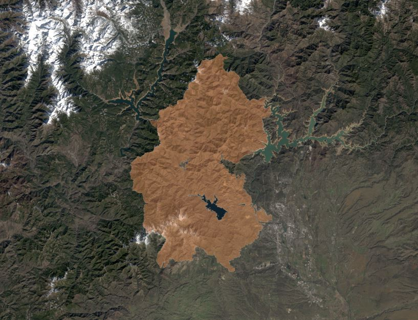

---

## Portfolio

All work show was made during my graduate and undergraduate career. For privacy reasons I do not post the work from my current job.

# Cartography Work 
### All work show was made during my graduate and undergraduate career.For privacy reasons I do not post the work from my current job.

## Measuring the Effectiveness of Urban Forest Park Development to Offset the Urban Heat Island Effect in Portland, Oregon

As part of the Arbor Day Foundation the city of Portland, Oregon has been named a Tree City. Like most large cities, Portland is subject to the urban heat accumulations. When separated by census block groups the mean 2018 afternoon temperature and percent canopy cover have a correlation coefficient of -0.89. My idea was that urban forest parks would be a fitting remedy to the heat islands, given its status as a Tree City. This plan would treat all vacant lots as viable options to develop urban forest parks. I have found 4 census blocks with seemingly enough vacant lots, yet I consider this annalysis to be inconclusive. This is inconclusive because of the rudimentary techniques; it is with vector data and limited to arbitrary census block boundaries. Someday I wish to obtain reliable results with more advanced methods, using rasters and thermal imagery. 

---

## Power Line Georeferencing 

The power lines were georeferenced with my android phone. 

---

---

# Wildfire Analyses

## Carr Fire

This link is to an ArcGIS online map. It is an ongoing project of mine. I am measuring the regrowth of the Carr Fire and comparing it to the yearly precipitation totals.

---

## Google Earth Engine Applications

- [Kincade Fire dNBR](https://lrclarke.users.earthengine.app/view/kincade-fire-dnbr)
This is a Google Earth Application that allows the user to use a split screen slider to observe the damage of The 2019 Kincade Fire in Sonoma County, California. 

---

# Art and Graphic Design

---

Page template forked from <a href="https://github.com/evanca/quick-portfolio">evanca</a>

<!-- Remove above link if you don't want to attibute -->

---
